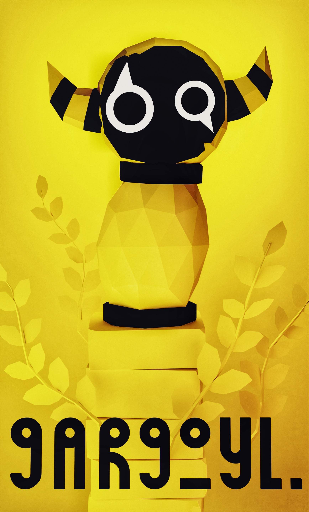

# Gargoyl

<p align="center">
  
</p>

Gargoyl is a text-based choose your own adventure game, where you investigate a mysterious garden and the stone gargoyle sitting at the centre of it. The game engine uses Text-to-Speech and GPT-3.5 API to generate responses, creating an immersive and interactive experience for the player.

## Getting Started

### Prerequisites

To run the game, you will need:

1. Python 3.7 or newer
2. OpenAI GPT-3.5 API key
3. ElevenLabs API key (optional, for better TTS quality)
4. FFmpeg (optional, for playing the background music)

### Installation

1. Clone the repo:
```
git clone https://github.com/your_username/gargoyl.git
```

2. Install the required Python packages:
```
pip install -r requirements.txt
```

3. Set up your OpenAI API key in a `.env` file in the project root directory:
```
OPENAI_KEY=your_openai_api_key_here
```

4. (Optional) Set up your ElevenLabs API key in the same `.env` file:
```
ELEVENLABS_KEY=your_elevenlabs_api_key_here
```

### Running the Game

To start the game, simply run the following command in the project root directory:

```
python main.py
```

You can choose between using a faster, local TTS engine (pyttsx3) or the ElevenLabs AI TTS engine. To use pyttsx3, pass `True` to the `main()` function in `main.py`:

```python
if __name__ == "__main__":
    main(True)
```

To use the ElevenLabs AI TTS engine, pass `False`:

```python
if __name__ == "__main__":
    main(False)
```

## Game Structure

The game consists of the following Python files:

1. `main.py`: Contains the main game engine and handles the initialization of the game, the TTS engine, and the game loop.
2. `prompt_handling.py`: Handles the creation and management of prompts for the GPT-3.5 API, as well as the Text-to-Speech functions.
3. `game_text.py`: Contains simple utility functions for displaying game text.

Additionally, there is an `assets` folder containing an MP3 file for background music, which requires a global installation of FFmpeg to play. If you don't want to play the background music, you can comment out the audio line in `main.py`.

## Acknowledgements

- OpenAI for the GPT-3.5 API
- ElevenLabs for their AI Text-to-Speech engine
- The Stanley Parable, for inspiring the witty and sarcastic narrator